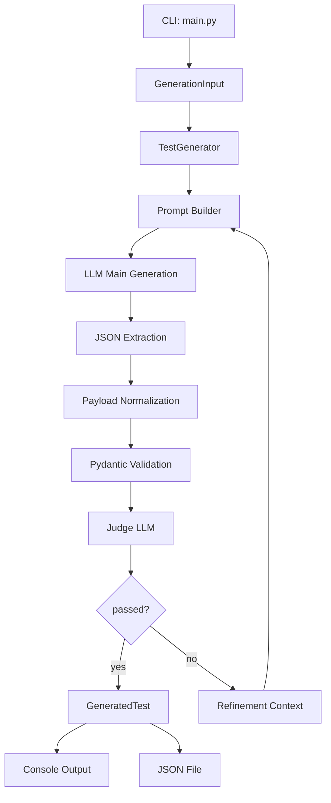
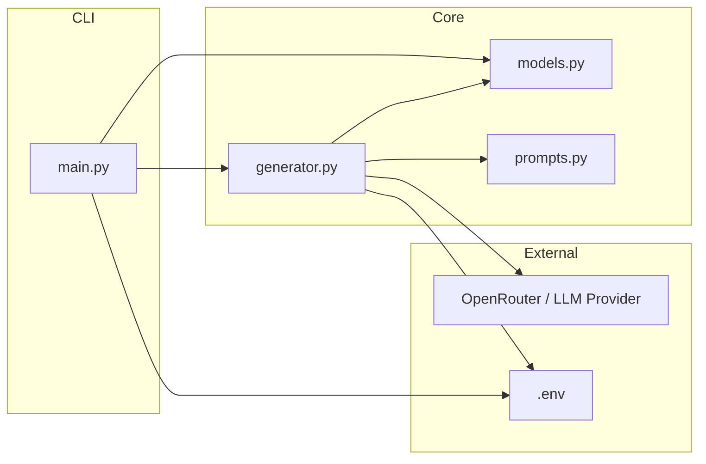
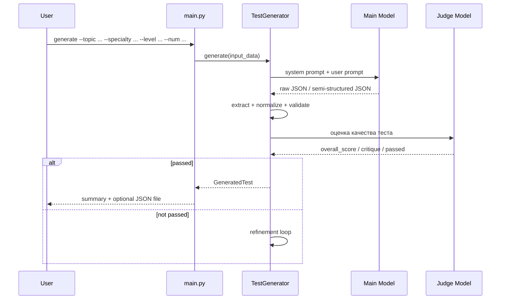
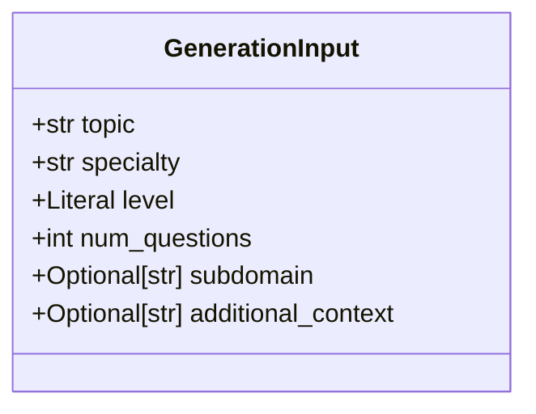
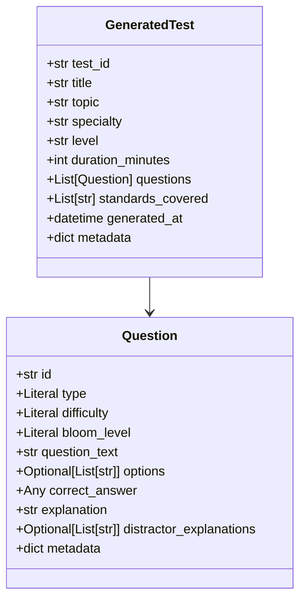
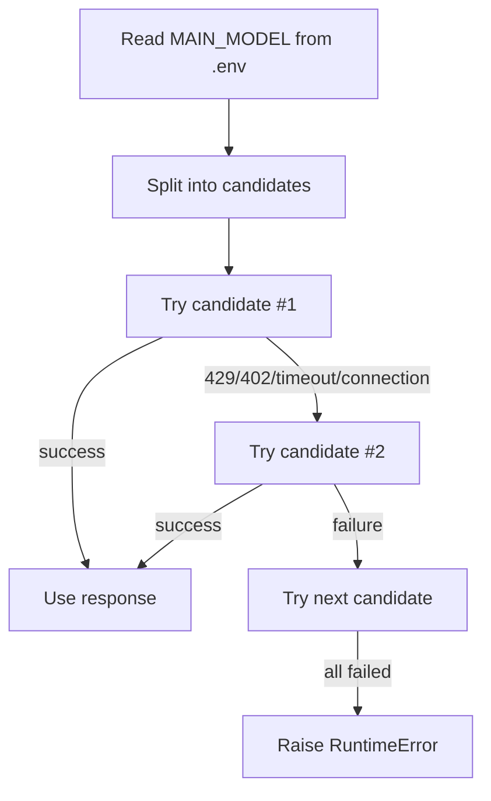
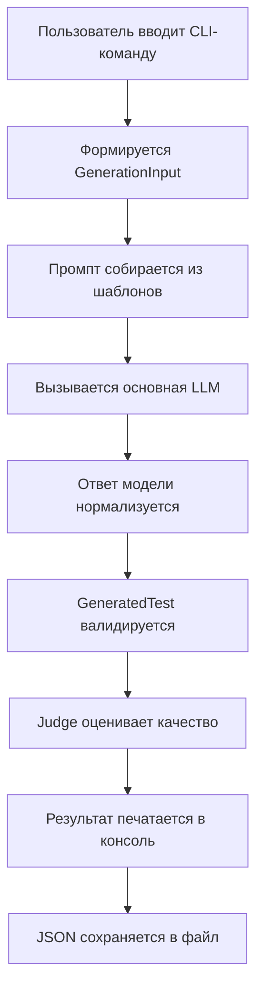

# LLM-core: Генератор Технических Тестов Для Нефтегазовой Отрасли

## О проекте

`LLM-core` — это CLI-приложение на Python для генерации структурированных технических тестов по hard skills в нефтегазовой отрасли.

Основная идея проекта:

- принять минимальный набор входных параметров;
- сгенерировать тест с помощью LLM;
- привести ответ модели к внутренней схеме данных;
- прогнать результат через judge-модель;
- вернуть готовый JSON-файл, пригодный для дальнейшей интеграции.

Проект ориентирован на сценарии вроде:

- контроль скважины;
- бурение;
- HSE;
- process safety;
- добыча и промысловые операции;
- оценка инженеров уровня `Junior`, `Middle`, `Senior`, `Expert`.

---

## Что умеет проект

- Генерирует тесты по теме, специальности, уровню и количеству вопросов.
- Поддерживает несколько типов вопросов:
  - `MCQ`
  - `Scenario`
  - `Calculation`
  - `Procedure`
- Проверяет структуру результата через Pydantic-модели.
- Выполняет пост-оценку качества через judge-модель.
- Поддерживает fallback по нескольким моделям из `.env`.
- Умеет сохранять результат в JSON-файл.
- Содержит runtime-логирование для диагностики LLM-вызовов.

---

## Текущий статус

Это рабочая MVP-архитектура с CLI, генерацией, нормализацией ответа LLM, judge-оценкой и конфигурацией через `.env`.

Что уже реализовано:

- CLI на `Typer`
- схемы данных на `Pydantic`
- генерация через `LangChain + ChatOpenAI`
- совместимость с OpenRouter
- нормализация “грязного” JSON-ответа модели
- fallback по списку моделей
- retry/backoff для временных ошибок провайдера

Что пока отсутствует:

- полноценный RAG
- HTTP API
- веб-интерфейс
- unit/integration tests
- production-grade observability

---

## Архитектура

### Высокоуровневая схема



### Архитектура компонентов



### Последовательность выполнения



---

## Структура проекта

```text
AI_test_genereation/
├── core/
│   ├── __init__.py
│   ├── generator.py
│   ├── models.py
│   └── prompts.py
├── docs/
│   ├── (Baseline) main system design.md
│   └── Development-plan.md
├── .env.example
├── main.py
├── requirements.txt
└── README.md
```

### Назначение файлов

- [main.py](file:///d:/Projects/AI_test_genereation/main.py) — CLI-вход в приложение.
- [generator.py](file:///d:/Projects/AI_test_genereation/core/generator.py) — основная логика генерации, fallback, retry, нормализация и judge.
- [models.py](file:///d:/Projects/AI_test_genereation/core/models.py) — входные и выходные Pydantic-модели.
- [prompts.py](file:///d:/Projects/AI_test_genereation/core/prompts.py) — system/user/judge prompt templates.
- [`.env.example`](file:///d:/Projects/AI_test_genereation/.env.example) — пример конфигурации.
- [requirements.txt](file:///d:/Projects/AI_test_genereation/requirements.txt) — Python-зависимости.
- [(Baseline) main system design.md](file:///d:/Projects/AI_test_genereation/docs/%28Baseline%29%20main%20system%20design.md) — исходная архитектурная заметка.
- [Development-plan.md](file:///d:/Projects/AI_test_genereation/docs/Development-plan.md) — исходный план разработки MVP.

---

## Основной поток данных

### 1. Вход

CLI принимает:

- `topic`
- `specialty`
- `level`
- `num_questions`
- `output` — путь к JSON-файлу

Эти значения превращаются в `GenerationInput`.

### 2. Формирование промпта

В [prompts.py](file:///d:/Projects/AI_test_genereation/core/prompts.py):

- `SYSTEM_PROMPT` задаёт роль senior petroleum engineer;
- `USER_PROMPT_TEMPLATE` подставляет тему, специальность, уровень и количество вопросов;
- `JUDGE_PROMPT_TEMPLATE` оценивает качество теста.

### 3. Вызов модели

В [generator.py](file:///d:/Projects/AI_test_genereation/core/generator.py):

- читается `MAIN_MODEL` из `.env`;
- если указано несколько моделей, они используются как fallback-кандидаты;
- вызывается первая доступная модель;
- при `429`, `402`, timeout или connection error выполняется переход к следующей модели.

### 4. Извлечение JSON

После ответа модели:

- извлекается текст ответа;
- убираются fenced code blocks;
- ищется JSON-объект;
- JSON парсится в `dict`.

### 5. Нормализация ответа

Поскольку LLM часто возвращает схему, не совпадающую 1-в-1 с внутренней моделью, проект делает нормализацию:

- `test_title` -> `title`
- `question` / `prompt` -> `question_text`
- `answer` -> `correct_answer`
- `standard_refs` -> `standards_covered`
- `options` как массив объектов -> `options` как массив строк
- `id` у вопросов приводится к строке
- отсутствующая `difficulty` восстанавливается из уровня

### 6. Валидация

Нормализованный payload валидируется через `GeneratedTest`.

### 7. Judge

Judge-модель получает уже нормализованный и валидный JSON.

Она возвращает:

- `overall_score`
- `critique`
- `passed`

Если `passed == false`, генератор добавляет critique в контекст и запускает refinement loop.

### 8. Вывод

В `main.py`:

- печатается краткое summary;
- показываются первые 2 вопроса;
- при `--output` результат сохраняется в JSON-файл.

---

## Схема данных

### Входная модель `GenerationInput`



### Выходная модель `GeneratedTest`



### Пример результата

```json
{
  "test_id": "b2f7c8f6-3f8f-42d6-96de-0d7a85d5d417",
  "title": "Контроль скважины - Senior",
  "topic": "Контроль скважины",
  "specialty": "Инженер по бурению",
  "level": "Senior",
  "duration_minutes": 21,
  "questions": [
    {
      "id": "1",
      "type": "Scenario",
      "difficulty": "Hard",
      "bloom_level": "Analyze",
      "question_text": "Что должен сделать инженер первым?",
      "options": [
        "A. Остановить циркуляцию",
        "B. Закрыть превентор",
        "C. Увеличить плотность раствора",
        "D. Продолжить бурение"
      ],
      "correct_answer": "B",
      "explanation": "Закрытие превентора — первичное действие при угрозе выброса.",
      "distractor_explanations": [],
      "metadata": {}
    }
  ],
  "standards_covered": [
    "API 53",
    "IWCF"
  ],
  "generated_at": "2026-06-09T12:00:00Z",
  "metadata": {
    "judge_score": 8.7,
    "judge_critique": "..."
  }
}
```

---

## Конфигурация

Проект полностью конфигурируется через `.env`.

Пример:

```env
OPENAI_API_BASE="https://openrouter.ai"
OPENAI_API_KEY="your api key"
OPENAI_TIMEOUT_SECONDS="30"

MAIN_MODEL="moonshotai/kimi-k2.6:free,qwen/qwen3.5-flash-02-23"
JUDGE_MODEL="qwen/qwen3.5-flash-02-23"
```

### Значение переменных

- `OPENAI_API_BASE` — базовый URL провайдера.
- `OPENAI_API_KEY` — API key.
- `OPENAI_TIMEOUT_SECONDS` — timeout одного вызова модели.
- `MAIN_MODEL` — одна модель или список моделей через запятую для генерации.
- `JUDGE_MODEL` — модель или список моделей для judge.

### Важный нюанс

Если используется OpenRouter и в `.env` указан `https://openrouter.ai`, проект сам нормализует адрес до `https://openrouter.ai/api/v1`.

---

## Стратегия отказоустойчивости

### Fallback по моделям



### Обработка ошибок

Проект отдельно различает:

- ошибки парсинга JSON;
- ошибки валидации Pydantic;
- ошибки провайдера (`402`, `429`, `timeout`, connection error);
- ошибки judge-модели.

Для judge сейчас предусмотрен fallback:

- если judge не отработал, возвращается безопасный результат по умолчанию;
- генерация теста при этом не блокируется.

---

## Логирование и отладка

В текущем состоянии в [generator.py](file:///d:/Projects/AI_test_genereation/core/generator.py) присутствует debug-инструментирование, добавленное в процессе runtime-отладки.

Оно логирует:

- инициализацию клиентов;
- попытки вызова моделей;
- успешные ответы;
- ошибки провайдера;
- шаги парсинга и нормализации;
- judge flow.

Сопутствующие артефакты:

- [debug-llm-test-generation.md](file:///d:/Projects/AI_test_genereation/debug-llm-test-generation.md)
- директория `.dbg/` во время активной отладки

Это полезно для диагностики нестабильного поведения free-моделей OpenRouter.

---

## Ограничения текущей версии

### 1. Зависимость от внешнего провайдера

Если OpenRouter возвращает:

- `429` — rate limit;
- `402` — недостаточно кредитов;

то проект корректно диагностирует проблему, но не может “починить” внешний лимит самостоятельно.

### 2. Нет полноценного RAG

Сейчас `context` в генераторе — это stub:

```python
context = "Нет дополнительного контекста."
```

Архитектурно место для RAG предусмотрено, но сам retrieval-пайплайн ещё не реализован.

### 3. Нет автоматических тестов

На данный момент проекту не хватает:

- unit tests для нормализации JSON;
- integration tests для CLI;
- contract tests для judge.

### 4. Judge fallback упрощён

Если judge падает, проект возвращает условный безопасный результат, чтобы не ломать основной pipeline.

---

## Установка

### 1. Создать окружение

```bash
python -m venv .venv
```

### 2. Активировать окружение

Windows PowerShell:

```powershell
.\.venv\Scripts\Activate.ps1
```

### 3. Установить зависимости

```bash
pip install -r requirements.txt
```

### 4. Создать `.env`

Скопируйте [`.env.example`](file:///d:/Projects/AI_test_genereation/.env.example) в `.env` и заполните значения.

---

## Запуск

### Базовый запуск

```bash
python main.py generate --topic "Контроль скважины" --specialty "Инженер по бурению" --level Senior --num 5
```

### Сохранение результата в файл

```bash
python main.py generate --topic "Контроль скважины" --specialty "Инженер по бурению" --level Senior --num 5 --output result.json
```

### Примеры сценариев

```bash
python main.py generate --topic "Well Control" --specialty "Drilling Engineer" --level Senior --num 6
python main.py generate --topic "Process Safety" --specialty "Production Engineer" --level Middle --num 5
python main.py generate --topic "Буровой раствор" --specialty "Mud Engineer" --level Junior --num 4
```

---

## Пример пользовательского сценария



---

## Основные зависимости

- `pydantic>=2`
- `langchain`
- `langchain-openai`
- `python-dotenv`
- `typer`
- `rich`

---

## Дальнейшее развитие

Ближайшие логичные шаги:

- вынести debug-инструментацию из бизнес-кода после завершения отладки;
- добавить unit tests для `_normalize_generated_test_payload()`;
- добавить поддержку явного `max_tokens` через `.env`;
- реализовать RAG-слой;
- добавить FastAPI-обёртку поверх CLI;
- собирать метрики качества generated tests.

---

## Исходные архитектурные материалы

- [(Baseline) main system design.md](file:///d:/Projects/AI_test_genereation/docs/%28Baseline%29%20main%20system%20design.md)
- [Development-plan.md](file:///d:/Projects/AI_test_genereation/docs/Development-plan.md)

---

## Краткое резюме

`LLM-core` — это MVP-движок генерации технических тестов по нефтегазовой тематике с CLI-интерфейсом, Pydantic-схемой, fallback по моделям, judge-оценкой и адаптацией “грязных” ответов LLM к строгой структуре данных.

Сильная сторона текущей версии — не просто “сгенерировать текст”, а довести ответ модели до валидного и пригодного к дальнейшему использованию JSON-объекта.
