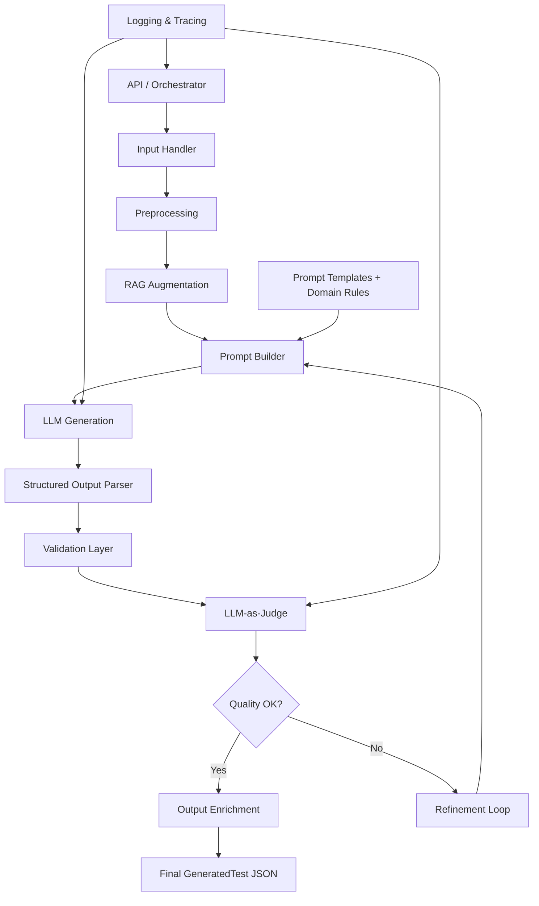

# System Design: LLM-core для генерации тестов (базовая версия)

## 1. Общая информация

**Цель LLM-core**:  
Генерировать структурированные JSON-тесты по hard skills в нефтегазовой отрасли на основе минимального набора входных параметров.

**Текущая версия**: Базовая (MVP)

**Ключевые входные параметры**:
- `topic` — тема теста
- `specialty` — специальность
- `level` — уровень (Junior / Middle / Senior / Expert)
- `num_questions` — количество вопросов

**Выход**: Полностью валидный JSON по схеме `GeneratedTest`

---

## 2. Высокоуровневая архитектура



## 3. Компоненты LLM-core

| Компонент                | Ответственность                                      | Примечание (Oil&Gas)                          |
|--------------------------|------------------------------------------------------|-----------------------------------------------|
| **Input Handler**        | Приём и валидация входных данных                     | Обязательные поля: topic, specialty, level, num_questions |
| **Preprocessing**        | Расширение темы, генерация подтем, Bloom levels     | Учёт HSE-приоритета                           |
| **RAG Augmentation**     | Добавление релевантного отраслевого контекста        | Стандарты API, ISO, ГОСТ, safety manuals      |
| **Prompt Builder**       | Сборка System и User промптов                        | Шаблоны + few-shot examples                   |
| **LLM Generation**       | Основная генерация теста                             | Structured Outputs                            |
| **Structured Output Parser** | Гарантия соответствия JSON-схеме                  | Pydantic / native Structured Outputs          |
| **Validation Layer**     | Синтаксическая проверка                              | —                                             |
| **LLM-as-Judge**         | Семантическая оценка качества теста                  | Rubric с акцентом на HSE и точность           |
| **Refinement Loop**      | Улучшение теста при низком качестве                  | Максимум 2–3 итерации                         |
| **Output Enrichment**    | Добавление metadata, test_id, timestamps             | Трассировка RAG-источников                    |

---

## 4. Data Flow (основной путь)

1. **Вход** — `GenerationInput` (topic, specialty, level, num_questions + optional)
2. **Preprocessing** — формирование расширенного контекста и целевых Bloom levels
3. **RAG Augmentation** — получение и подготовка контекста (если доступен)
4. **Prompt Builder** — создание полного промпта
5. **LLM Generation** — вызов LLM с Structured Output
6. **Validation + Judge** — проверка схемы и качества
7. **Refinement Loop** (при необходимости) — добавление critique и повторная генерация
8. **Output** — `GeneratedTest` JSON

---

## 5. JSON-схемы

### GenerationInput (вход)

```json
{
  "topic": "Контроль скважины и предотвращение выбросов",
  "specialty": "Инженер по бурению",
  "level": "Senior",
  "num_questions": 6,
  "subdomain": "Upstream",
  "additional_context": "Акцент на shut-in procedures"
}
```

### GeneratedTest (выход)

```json
{
  "test_id": "ng_test_12345",
  "title": "Senior — Контроль скважины",
  "topic": "Контроль скважины и предотвращение выбросов",
  "specialty": "Инженер по бурению",
  "level": "Senior",
  "duration_minutes": 45,
  "total_questions": 6,
  "questions": [
    {
      "id": "q1",
      "type": "Scenario",
      "difficulty": "Hard",
      "bloom_level": "Analyze",
      "question_text": "...",
      "options": ["A", "B", "C", "D"],
      "correct_answer": "B",
      "explanation": "...",
      "distractor_explanations": ["...", "..."],
      "metadata": { ... }
    }
  ],
  "standards_covered": ["API RP 53", "IWCF"],
  "generated_at": "2026-06-08T12:00:00Z",
  "metadata": {
    "judge_score": 9.2,
    "model_used": "gpt-4o"
  }
}
```

---

## 6. Prompt Strategy

- **System Prompt**: Фиксированный, содержит роль senior petroleum engineer, правила отрасли (HSE priority, standards compliance), требование выводить только JSON.
- **User Prompt**: Динамический шаблон, подставляет входные параметры + RAG-контекст.
- **Judge Prompt**: Отдельный промпт с детальной rubric оценки.

---

## 7. Качество и Надёжность

- **Grounding** — максимальное использование RAG
- **HSE Guardrails** — обязательная проверка в Judge
- **Structured Outputs** — минимизация парсинг-ошибок
- **Refinement** — автоматическое улучшение
- **Logging** — полный trace каждого запроса

---

## 8. Roadmap

**Phase 0 (Базовая — текущая)**: Single generation + Judge + Refinement  
**Phase 1**: Multi-step workflow + semantic cache  
**Phase 2**: Multi-agent + self-consistency  
**Phase 3**: Domain-specific fine-tuning (LoRA)